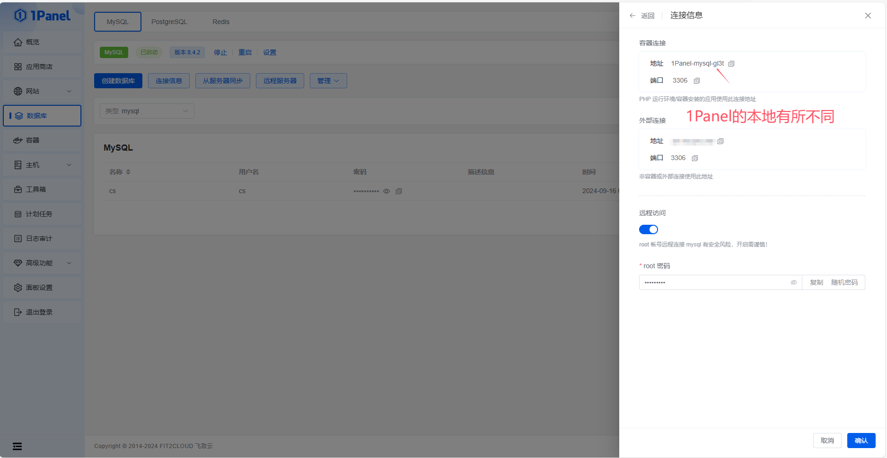
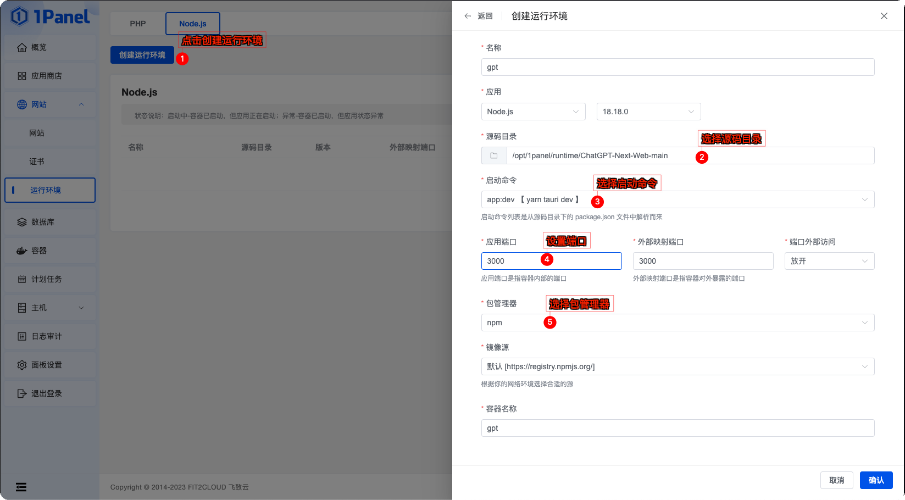
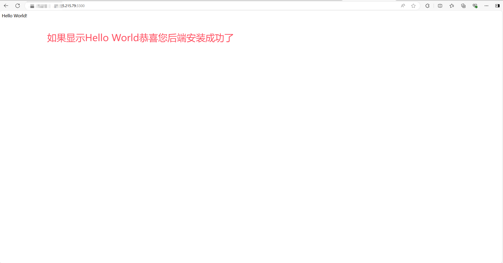
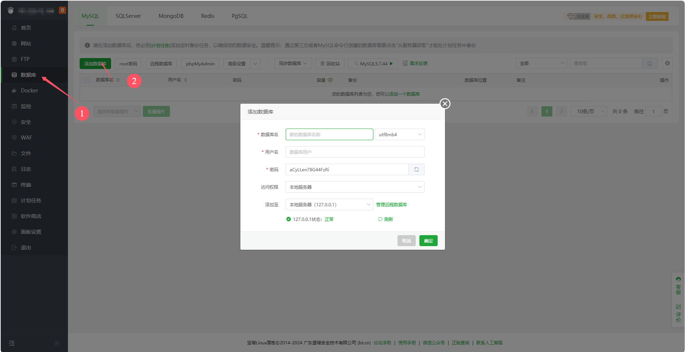
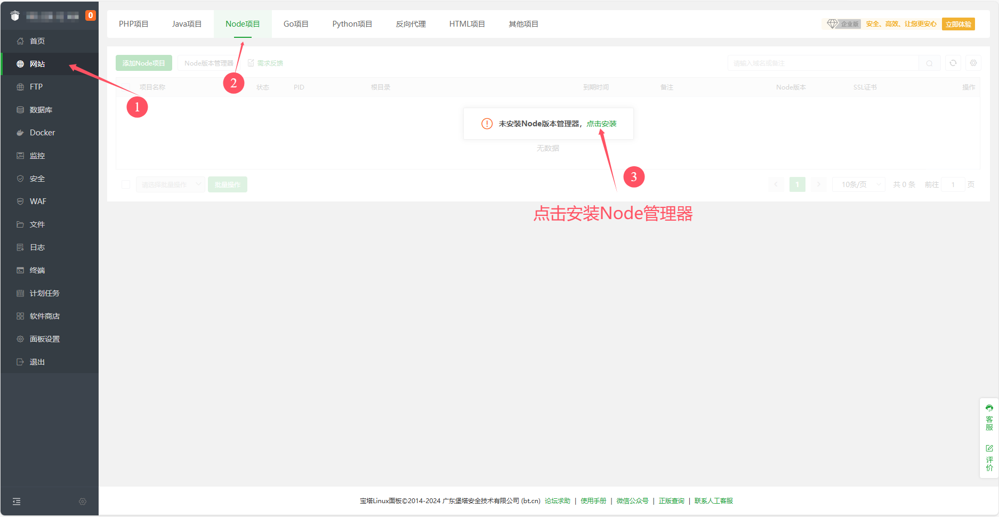
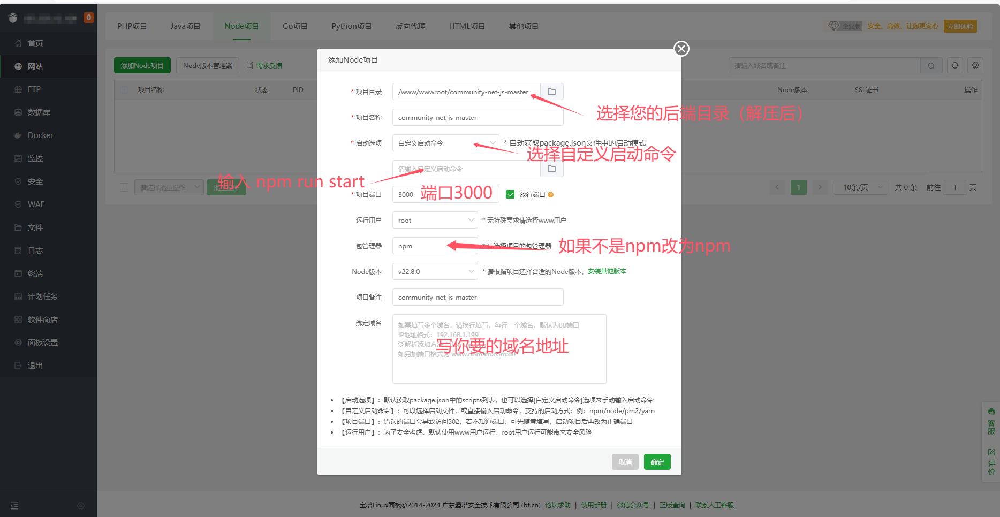

# 后端构建安装<Badge type="tip" text="Build install" vertical="top" />

## 1Panel安装

### 介绍

1Panel 是新一代的 Linux 服务器运维管理面板，使用面板无需登录，程序部分开源，应用基于容器化安装，对服务器破坏小，安装快。

### 安装面板

基于1Panel[官方文档](https://1panel.cn/docs/installation/online_installation/)在你的服务器完成程序安装，安装完成后登录进入面板。

### 安装数据库

在1Panel应用商店搜索并选择安装`MySQL`或`MariaDB`，目前推荐安装`MariaDB`数据库，完全兼容`MySQL`数据库。

参考官方[数据库使用文档](https://1panel.cn/docs/user_manual/databases/mysql/)进入面板新建`MySQL`数据库。

数据库新建完毕后，单击`连接信息`获取数据库连接信息。

### 配置程序设置

修改程序根目录下的`.env`文件，以对程序进行配置相关。

::: warning
JWT密钥 需要填写长度不小于 16 个字符，不大于 32 个字符的字符串，用于加密用户的 Token，务必保存好自己的密钥，不要泄露给他人。
:::

### 启动程序

前往网站-运行环境-Node.js-创建运行环境

- 应用端口填写：`3000`
- 外部端口：`任意填写（不建议3000）`
- 启动命令：选择一旁`自定义启动命令`，并填入`npm run start`
- 包管理器：`npm`

确认后会自动启动并安装模块请耐心等待，期间无需操作。

### 测试

前往网站反代你设定的外部端口或者访问`ip:{你设定的端口}`检查后端是否运行。

## 宝塔安装

### 介绍

宝塔,“安全高效”的服务器运维面板，比较适合新手使用，发展时间较长功能也算完善。

### 安装宝塔面板

参考[官方安装文档](https://www.bt.cn/new/download.html)在你的服务器完成宝塔安装。

### 安装数据库

参考宝塔官方手册[数据库管理](https://www.kancloud.cn/chudong/bt2017/424247)进行安装和新建数据库。

### 配置程序设置

修改程序根目录下的`.env`文件，以对程序进行配置相关。

::: warning
JWT密钥 需要填写长度不小于 16 个字符，不大于 32 个字符的字符串，用于加密用户的 Token，务必保存好自己的密钥，不要泄露给他人。
:::

### 启动程序

参考宝塔官方手册[创建站点](https://www.kancloud.cn/chudong/bt2017/3130614)部分完成Node.js程序新建配置。

::: warning
Node版本请选择18+，过旧的版本会导致程序无法正常运行。
:::

### 测试

前往网站反代你设定的外部端口或者访问`ip:{你设定的端口}`检查后端是否运行。

