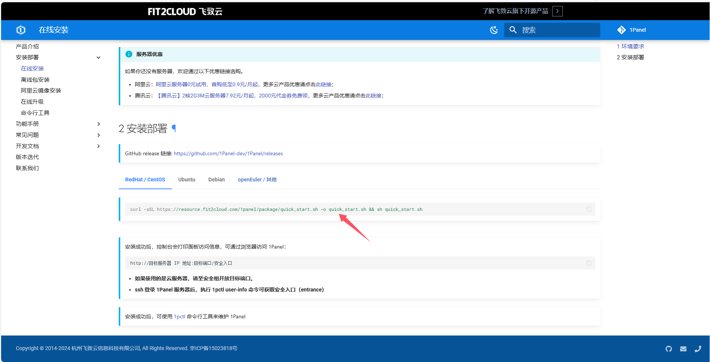

# 后端构建安装<Badge type="tip" text="Build install" vertical="top" />

## 1Panel安装
### 介绍

1Panel 是新一代的 Linux 服务器运维管理面板，使用面板无需登录，程序部分开源，应用基于容器化安装，对服务器破坏小，安装快。

### 安装面板

基于1Panel[官方文档](https://1panel.cn/docs/installation/online_installation/)在你的服务器完成程序安装，安装完成后登录进入面板。

### 安装数据库

在1Panel应用商店搜索并选择安装`MySQL`或`MariaDB`，目前推荐安装`MariaDB`数据库，完全兼容`MySQL`数据库。

参考官方[数据库使用文档](https://1panel.cn/docs/user_manual/databases/mysql/)进入面板新建`MySQL`数据库。

数据库新建完毕后，单击`连接信息`获取数据库连接信息。

### 配置数据库地址

找到本地安装程序的目录，并且前往指定配置文件修改数据库连接信息。

